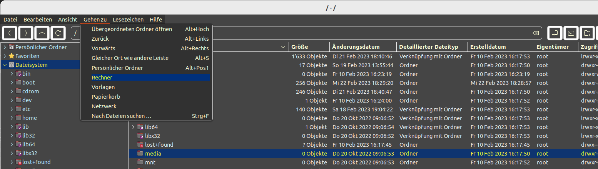

# Ubuntu Stuff

Scripts, css, etc. for my Ubuntu Desktop

***

## Nemo dark theme

See [``nemo\gtk.css file``](./nemo/gtk.css)\
Ubuntu Path: ``~/.config/gtk-3.0/gtk.css``

Nemo dark

***

## Nemo custom action

See folder [nemo](./nemo/).\
Copy file or files to your home .local... folder: ~/.local/share/nemo/actions

- Integrate [Meld diff tool](https://de.wikipedia.org/wiki/Meld) to context menu: [``meld diff f1 f2 [f3].nemo_action``](./nemo/meld/meld%20diff%20f1%20f2%20%5Bf3%5D.nemo_action)

- Integrate the [kdiff3](https://apps.kde.org/kdiff3/) (file and folder diff and merge tool) to context menu: [``kdiff3 diff f1 f2 [f3].nemo_action``](./nemo/kdiff/kdiff3%20diff%20fi%20f2%20%5Bf3%5D.nemo_action).\
Compare files or folders with different paths using kdiff3. 1st remember action with: [``kdiff3 remember path for later diff.nemo_action``](./nemo/kdiff/kdiff3%20remember%20path%20for%20later%20diff.nemo_action), then select second file/folder and start diff with: [``kdiff3 diff with previous stored path.nemo_action``](./nemo/kdiff/kdiff3%20diff%20with%20previous%20stored%20path.nemo_action). Both action uses shell: [``kdiff3_remember_restore_path.sh``](./nemo/kdiff/kdiff3_remember_restore_path.sh). Set mode for shell file to executable: ``chmod +x kdiff3_remember_restore_path.sh``.

- Integrate the [Gnome Terminator](https://en.wikipedia.org/wiki/GNOME_Terminator) (Multiple terminals in one window) to context menu:
[open.terminator.multi.folder.nemo_action](./nemo/Terminator/open.terminator.multi.folder.nemo_action).\
The Action uses the following bash script: [open.terminator.multi.folder.sh](./nemo/Terminator/open.terminator.multi.folder.sh) copy it to nemo/action folder too.\
And set mode to executable: ``chmod +x open.terminator.multi.folder.sh``

- Integrate the file archiver [p7zip (7-Zip)](https://www.7-zip.org/) with script: [7z_archive_with_ultra_settings.nemo_action](./nemo/p7zip/7z_archive_with_ultra_settings.nemo_action).\
The Action uses the following bash script: [7z_archive_with_ultra_settings.sh](./nemo/p7zip/7z_archive_with_ultra_settings.sh) copy it to nemo/action folder too.\
And set mode to executable: ``chmod +x 7z_archive_with_ultra_settings.sh``\
The prerequisite is that [p7zip-full](https://packages.ubuntu.com/search?keywords=p7zip-full) is installed. ``sudo apt install p7zip-full``

***

## Nautilus (file manager for GNOME 'Files') helper scripts

See folder [nautilus](./nautilus/).\
Copy file to your home .local... folder: ~/.local/share/nautilus/scripts.\
Allow script to be run by nautilus with the command: ``chmod +x 'meld diff f1 f2 [f3]'`` 

- Integrate [Meld diff tool](https://de.wikipedia.org/wiki/Meld) to context menu: [``meld diff f1 f2 [f3]``](./nautilus/meld%20diff%20f1%20f2%20%5Bf3%5D)

- Integrate the [Gnome Terminator](https://en.wikipedia.org/wiki/GNOME_Terminator) (Multiple terminals in one window) to context menu. Opens Terminator even if folder path is a Samba Server path. Uses Nautilus Samba 'mount point': /run/user/$(id -u)/gvfs...\
[``Open in Gnome Terminator``](./nautilus/Open%20in%20Gnome%20Terminator)

***

## Add a console program to 'Show Applications' and Applications Menu

[Start a console program from 'Show Applications' and Applications Menu if active.](./varia/Desktop/Call%20terminal%20app%20from%20menu.md)

***

## Mouse button mapping with imwheel

[Use 'imwheel' to mapping specific mouse buttons for specific function on apps.](./desktop/imwheel/Mouse%20button%20mapping.md)

***

## Snap

Instead of laboriously updating the snap applications via the UI, [I use the following script.](./snap/snap-update.sh)

Don't forget set mode to executable: ``chmod +x snap-update.sh``

***
