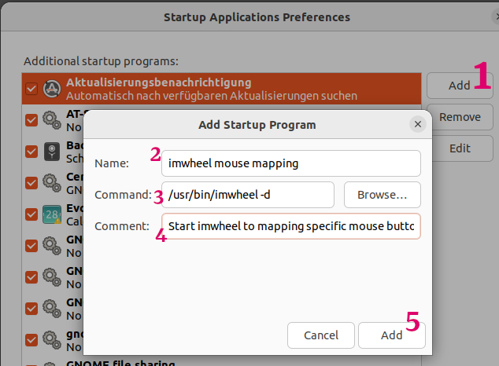

# Mouse button mapping with imwheel

imwheel - a mouse wheel and button interpreter for X Windows.
Use 'imwheel' to mapping specific mouse buttons for specific function on apps.

**Some applications do not work on the Wayland desktop** such as Terminator, Nemo, etc.
Check whether Wayland in use. Use the following command in a terminal:

``echo $XDG_SESSION_TYPE``

Ouput: ``wayland``

[The Readme of the project.](https://imwheel.sourceforge.net/README)\
[man page.](https://manpages.ubuntu.com/manpages/kinetic/en/man1/imwheel.1.html)

- Install imwheel\
``sudo apt install imwheel``

- Configuration\
Copy my '.imwheelrc' to your home directory. Change and expand the mouse button assignment according to your taste.

- Testing the configuration\
This will run IMWheel in the foreground in debug mode:\
``imwheel -d --debug --kill``

- Testing example output:\
In Firefox if you click wheel left button 'imwheel' sends "Alt_L" and "Left" (=left arrow) to Firefox see 'Keysyms Out' below, means Browser goes back.

```java
WinAction (0x47112c33ff5a):
    Priority         : 0
    Window Regex     : "^firefox$" = Button mapping for Firefox browser.
    Keysyms Mask (0x47112c33ff5a):
        "None"
    Button           : 6           = Mouse Wheel Left Button, see man page.
    Keysyms Out (0x47112c33ff5a) :
        "Alt_L"                    = sent keys to Firefox.
        "Left"
    Reps: 1
    Rep Delay: 0
    Key Up Delay: 0
```

- Auto start the imwheel\
Alt+F2 then enter ``gnome-session-properties``


