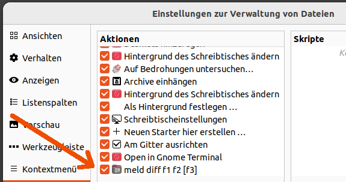

## Nemo Action Tag: ``Icon-Name=``

[List of Names see here](
https://github.com/linuxmint/nemo/blob/master/libnemo-private/nemo-icon-names.h)

### Icons showed in Module (Alt+P)
Example ``Icon-Name=folder-templates``
