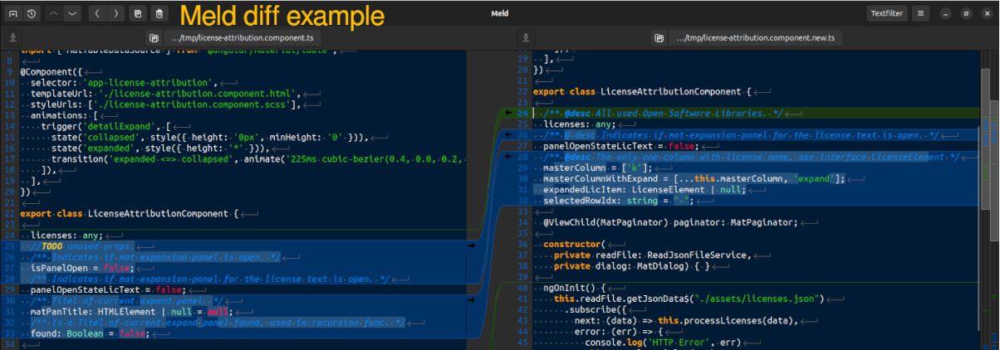
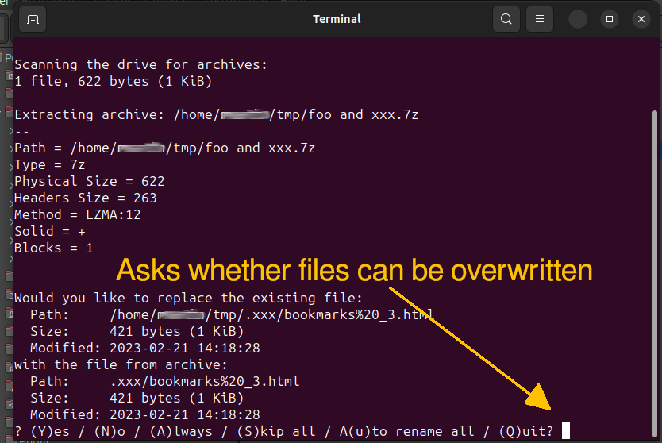
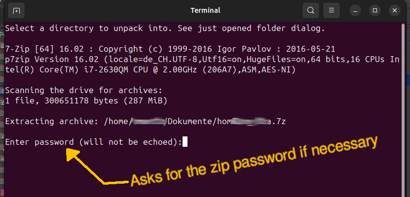
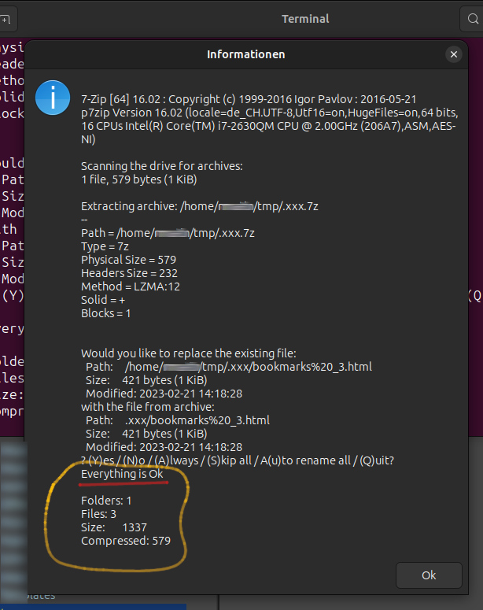

# My Nemo Actions

## KDiff3

- Integrate the [kdiff3](https://apps.kde.org/kdiff3/) (file and folder diff and merge tool) to context menu: [``kdiff3 diff f1 f2 [f3].nemo_action``](./kdiff/kdiff3%20diff%20f1%20f2%20[f3].nemo_action).\
Compare files or folders with different paths using kdiff3. 1st remember action with: [``kdiff3 remember path for later diff.nemo_action``](./nemo/kdiff/kdiff3%20remember%20path%20for%20later%20diff.nemo_action), then select second file/folder and start diff with: [``kdiff3 diff with previous stored path.nemo_action``](./nemo/kdiff/kdiff3%20diff%20with%20previous%20stored%20path.nemo_action). Both action uses shell: [``kdiff3_remember_restore_path.sh``](./nemo/kdiff/kdiff3_remember_restore_path.sh). Set mode for shell file to executable: ``chmod +x kdiff3_remember_restore_path.sh``.

***

## Meld

- Meld is a visual diff and merge tool, targeted at developers.
\
Integrate [Meld diff tool](https://en.wikipedia.org/wiki/Meld_(software)) to context menu: [``meld diff f1 f2 [f3].nemo_action``](./meld/meld%20diff%20f1%20f2%20%5Bf3%5D.nemo_action)

***

## p7zip

**DO NOT USE the 7‐zip format for backup purpose** on Linux/Unix because :
7‐zip does not store the owner/group of the file.

- **Adds files or directories to 7-Zip archive using "ultra settings"**
\
Integrate the file archiver [p7zip (7-Zip)](https://www.7-zip.org/) with script: [7z_archive_with_ultra_settings.nemo_action](./p7zip/7z_archive_with_ultra_settings.nemo_action).\
The Action uses the following bash script: [7z_archive_with_ultra_settings.sh](./p7zip/7z_archive_with_ultra_settings.sh) copy it to nemo/action folder too.\
And set mode to executable: ``chmod +x 7z_archive_with_ultra_settings.sh``\
The prerequisite is that [p7zip-full](https://packages.ubuntu.com/search?keywords=p7zip-full) is installed. ``sudo apt install p7zip-full``\

- **Extract 7-Zip, zip, bzip2, gz Archive**
\
Integrate the file archiver [p7zip (7-Zip)](https://www.7-zip.org/) to extract 7z, zip, bzip2, gz Archive with the script: [7z_extraction.nemo_action](./p7zip/7z_extraction.nemo_action).\
**Asks for destination folder. Asks whether files can be overwritten. Asks for the zip password if necessary.**\
The Action uses the following bash script: [7z_extraction.sh](./p7zip/7z_extraction.sh) copy it to nemo/action folder too.\
And set mode to executable: ``chmod +x 7z_extraction.sh``\
The prerequisite is that [p7zip-full](https://packages.ubuntu.com/search?keywords=p7zip-full) is installed. ``sudo apt install p7zip-full``\

***
