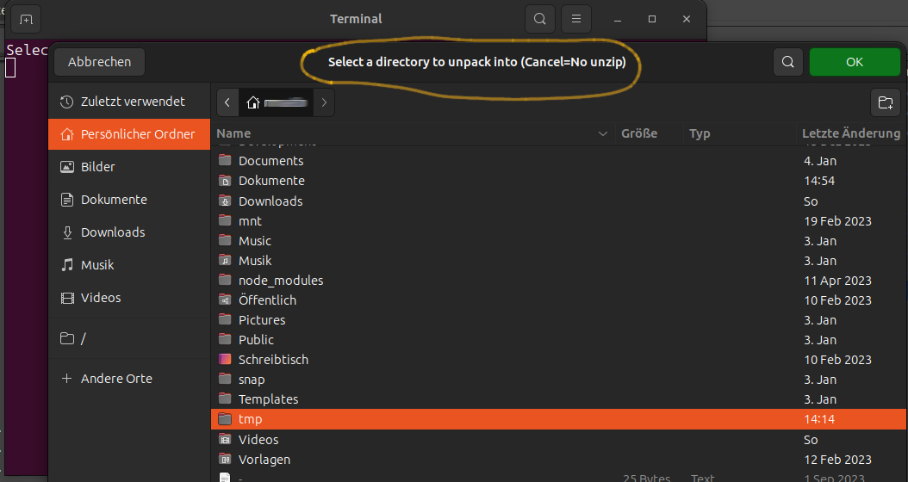

# My Nemo Actions

## p7zip

**DO NOT USE the 7‐zip format for backup purpose** on Linux/Unix because :
7‐zip does not store the owner/group of the file.

- **Adds files or directories to 7-Zip archive using "ultra settings"**
\
Integrate the file archiver [p7zip (7-Zip)](https://www.7-zip.org/) with script: [7z_archive_with_ultra_settings.nemo_action](./p7zip/7z_archive_with_ultra_settings.nemo_action).\
The Action uses the following bash script: [7z_archive_with_ultra_settings.sh](./p7zip/7z_archive_with_ultra_settings.sh) copy it to nemo/action folder too.\
And set mode to executable: ``chmod +x 7z_archive_with_ultra_settings.sh``\
The prerequisite is that [p7zip-full](https://packages.ubuntu.com/search?keywords=p7zip-full) is installed. ``sudo apt install p7zip-full``\

- **Extract 7-Zip, zip, bzip2, gz Archive**
\
Integrate the file archiver [p7zip (7-Zip)](https://www.7-zip.org/) to extract 7z, zip, bzip2, gz Archive with the script: [7z_extraction.nemo_action](./p7zip/7z_extraction.nemo_action).\
**Asks for destination folder. Asks whether files can be overwritten. Asks for the zip password if necessary.**\
The Action uses the following bash script: [7z_extraction.sh](./p7zip/7z_extraction.sh) copy it to nemo/action folder too.\
And set mode to executable: ``chmod +x 7z_extraction.sh``\
The prerequisite is that [p7zip-full](https://packages.ubuntu.com/search?keywords=p7zip-full) is installed. ``sudo apt install p7zip-full``\

***
