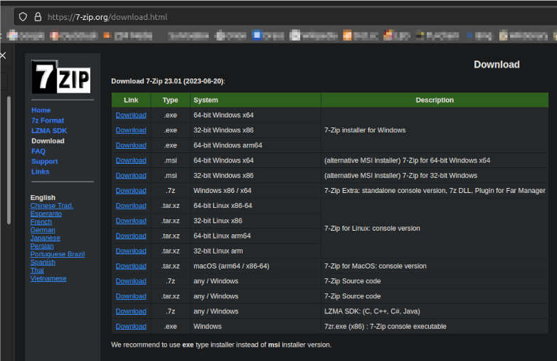
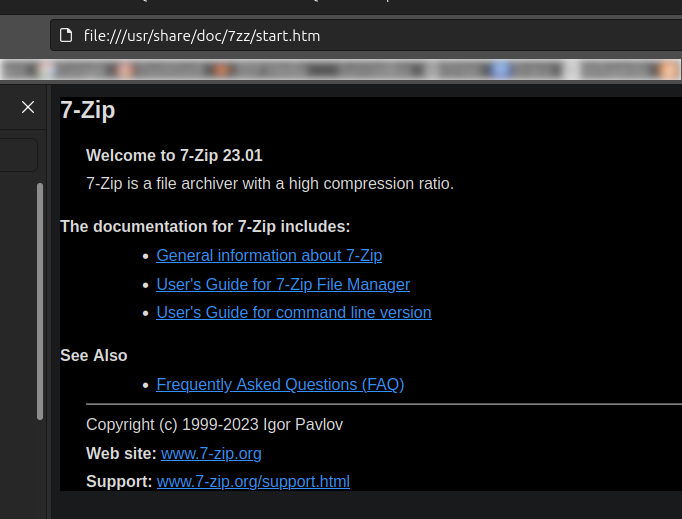

# Install 7-Zip (executable 7zz) from 7-Zip home page

## Why I installed 7-Zip from the 7-Zip homepage

I installed p7zip-full (exe is 7z) from Ubuntu's repository. Unfortunately p7zip-full from the repository is a very old version 16.02. The "current" version is on 23.nn. That's why I installed 7-Zip by hand. \
I proceeded as follows:

1. Download the tar file from 7-Zip home page \
``https://7-zip.org/download.html`` [7-Zip Downlaod page](https://7-zip.org/download.html) \
Select the appropriate linux system to download \


1. Untar archive into a temp folder e.g. ~/tmp \
``tar xf archive.tar.xz``
\
&nbsp;
1. Copy 7zzs (static binary version) to /usr/sbin \
``sudo cp 7zzs /usr/sbin``
\
&nbsp;
1. Copy the 7zz html docu to /usr/share/doc/7zz, create folder 7zz if it not exists \
   ``sudo mkdir /usr/share/doc/7zz`` \
   Copy all files and folders from the extracted tar folder named MANUAL to ...doc/7zz \
   ``sudo cp -R ~/tmp/MANUAL/* /usr/share/doc/7zz``
\
&nbsp;
1. Create the man page from exe (default is man section 1). The name must be xxx.1 is important \
   ``help2man --no-discard-stderr 7zzs >7zzs.1`` \

   Add the HTML document URL to the newly generated man file 7zzs.1 as the last line

    ```man
        ...
        should give you access to the complete manual.
        .br
        Full documentation <file:///usr/share/doc/7zz/start.htm>

    ```

1. Compress and copy man file to the man folder then update man DB \
``gzip 7zzs.1`` \
``sudo cp 7zzs.1.gz /usr/local/share/man/man1/`` \
``sudo mandb`` \
\
&nbsp;
1. Test the man page in a console/terminal \
``man 7zzs`` \

```man
7ZZS(1)                               User Commands                               7ZZS(1)

NAME
       7zzs - manual page for 7zzs

SYNOPSIS
       7zz <command> [<switches>...] <archive_name> [<file_names>...] [@listfile]

DESCRIPTION
       7-Zip (z) 23.01 (x64) : Copyright (c) 1999-2023 Igor Pavlov : 2023-06-20

              64-bit locale=C.UTF-8 Threads:8 OPEN_MAX:1024, ASM

       <Commands>

              a  :  Add  files to archive b : Benchmark d : Delete files from archive e :
              Extract files from archive (without using directory names)  h  :  Calculate
              hash values for files i : Show information about supported formats l : List
              contents  of  archive  rn  :  Rename files in archive t : Test integrity of
              archive u : Update files to archive x : eXtract files with full paths

       <Switches>

       -- : Stop switches and @listfile parsing

       -ai[r[-|0]]{@listfile|!wildcard} : Include archives
       ...
       ...
              info 7zzs

       should give you access to the complete manual.
       Full documentation <file:///usr/share/doc/7zz/start.htm>
```

\
&nbsp;
6. Test html doc enter url in the browser or ctrl+click in the man page last line: file:///usr/share/doc/7zz/start.htm

Html 7zz doc displayed in the Browser \

