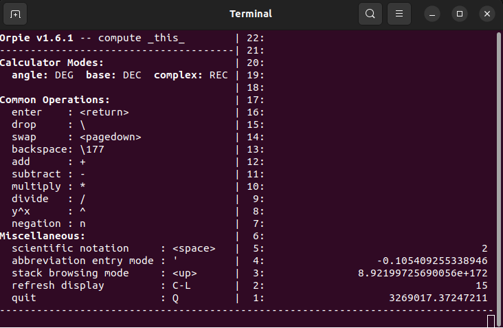

# Call a terminal app from Application Menu

## Example: orpie console-based RPN calculator

Orpie: A command-line reverse Polish notation calculator.\
Orpie is a scientific calculator that works similar to the previous popular HP calculators.\
[See orpie home page](https://github.com/pelzlpj/orpie)

- Install orpie calculator\
``$ sudo apt install orpie``

- Start orpie in a console\
``$ orpie``

- Start from the desktop\
Copy file [``orpie calculator.desktop``](orpie%20calculator.desktop) to Directory:\
``/home/username/.local/share/applications``
And the icon file [``orpie.png``](./orpie.png) too

- Restart Gnome Desktop in Ubuntu\
Press Alt + F2 , type the single letter r on the pop-up window, and press Enter.
