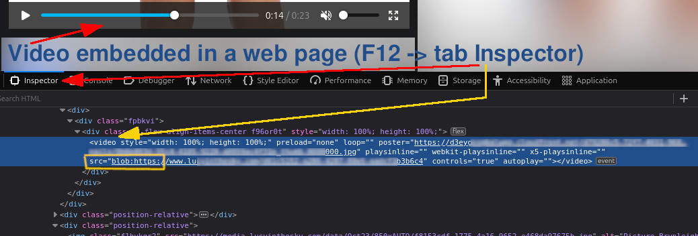
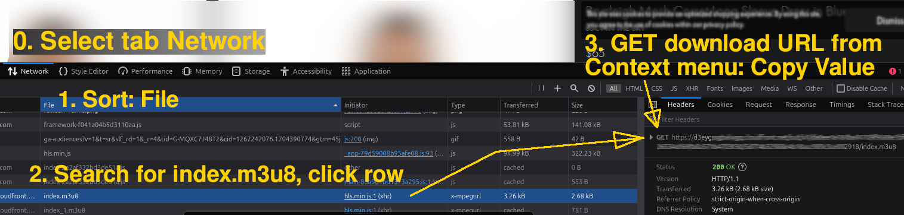
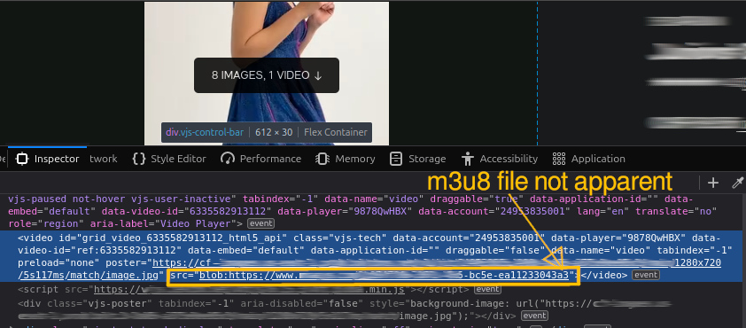
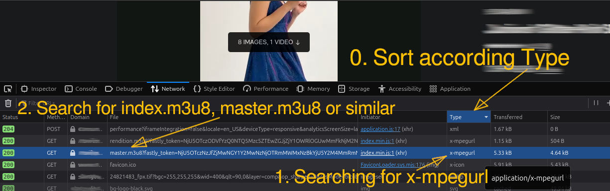

# Download an embedded video with src="blob:`https://www...`"

Download embedded videos which uses M3U8 file (media playlist). Determine URL and download it with ffmpeg.\
In embedded videos, the URL is often missing or specified as a 'blob'. How to download this video?

***

1. Get the video URL \
&nbsp;0. Open "Web Developer Tools" (Ctrl+Shift+I or F12). Select tab Network \
&nbsp;1. Sort according File (click at top of column named "File")\
&nbsp;2. Search for "index.m3u8" and click the row\
&nbsp;3. GET download URL, open context menu "Copy Value"

***

2. Download video with [FFmpeg](https://ffmpeg.org/) \
Use command ffmpeg in a console/terminal to download the video.\
Insert the copied URL after main option -i.\
\
&nbsp;
``ffmpeg -i 'https://d3eyg...2918/index.m3u8' -bsf:a aac_adtstoasc -vcodec copy -c copy -crf 50 file.mp4`` \
\
&nbsp;
Args and Options

* "[-i](https://ffmpeg.org//ffmpeg-all.html#Main-options) url"  is the input file or url.
* "-bsf:a [aac_adtstoasc](https://ffmpeg.org/ffmpeg-bitstream-filters.html#aac_005fadtstoasc)" = Convert MPEG-2/4 AAC ADTS to an MPEG-4 Audio Specific Configuration bitstream.
* "[-codec](https://ffmpeg.org//ffmpeg-all.html#Stream-specifiers-1) copy" or "-codec: copy" would copy all the streams without reencoding.
* "[-c](https://ffmpeg.org//ffmpeg-all.html#Main-options) copy" copies the first video, audio, and subtitle bitstream from the input to the output file without re-encoding them.
* "file.mp4" is the output file name.

***
\
&nbsp;

## What if the m3u8 file name is unrecognizable?

**Search the x-mpegurl type in the tab Network.**

* Sort according Type
* Searching for x-mpegurl
* Search for index.m3u8, master.m3u8 or similar in column File
* Click row, GET download URL from Header Tab, see 2nd picture above

