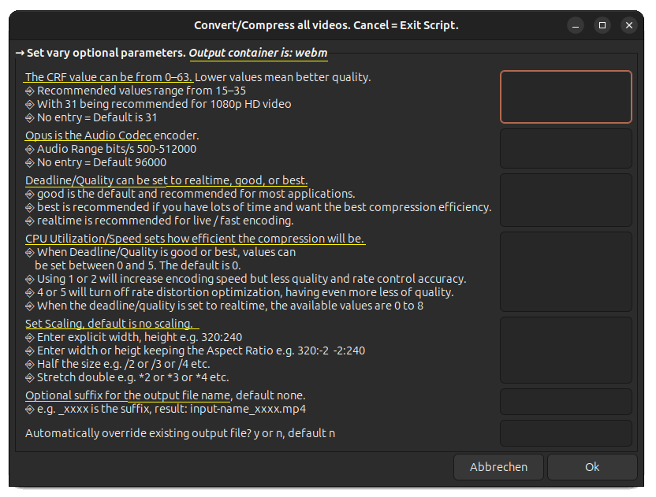

# Compress/Convert mp4 and webm Videos

The used encoder for mp4 is libx265 which can offer around 25–50% bitrate savings compared to H.264 video encoded with libx264.

The used encoder for webm is libvpx-vp9 can save about 20–50% bitrate compared to libx264 (the default H.264 encoder).

1. Prerequisites \
The script uses [FFmpeg](https://ffmpeg.org/download.html) and zenity (display GTK+ dialogs). zenity is on an Ubuntu already installed.

1. Choose the target video type to: convert and compress,  or only to compress.

1. Select one or more videos, can be vary types (mp4, webm, flv, etc.)

1. Select target folder

1. Set vary optional parameters for mp4 target container

If WebM is selected (1.) you have the following parameters available

