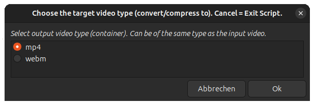
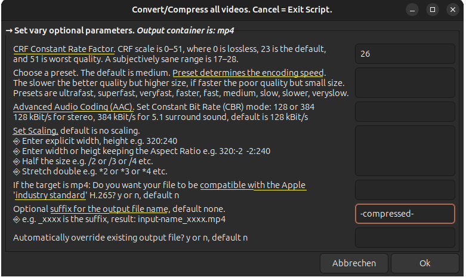

# Compress/Convert mp4 and webm Videos

1. Choose the target video type to: convert and compress,  or only to compress.

1. Select one or more videos, can be vary types (mp4, webm, flv, etc.)

1. Select target folder

1. Set vary optional parameters for mp4 target container
