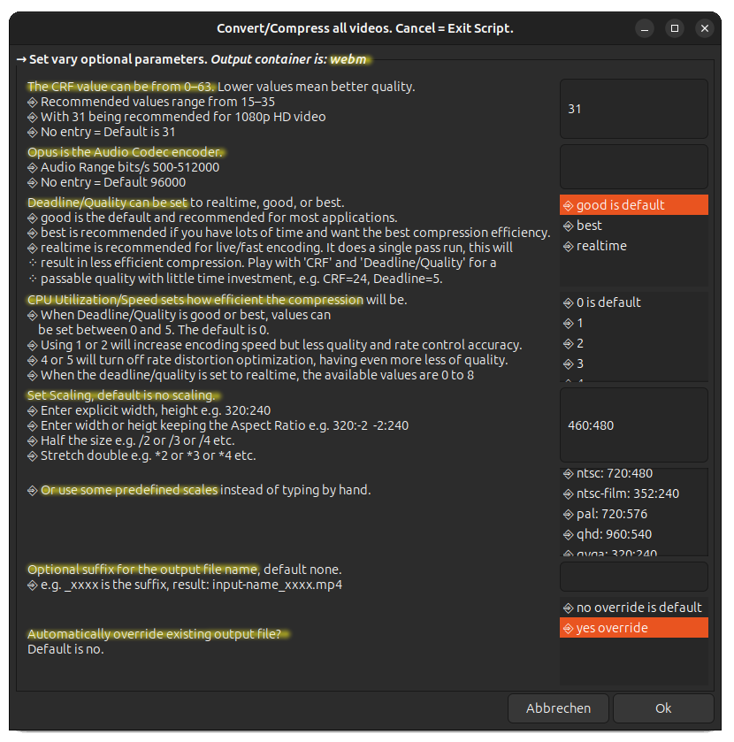

# Compress/Convert Videos

Compress/convert a common video format (containers like avi, flv, mkv, mov, wmv, mp4, ts, webm, etc.) to mp4 or webm.

The used encoder for mp4 is [libx265](https://trac.ffmpeg.org/wiki/Encode/H.265) which can offer around 25–50% bitrate savings compared to H.264 video encoded with libx264.

The used encoder for webm is [libvpx-vp9](https://trac.ffmpeg.org/wiki/Encode/VP9#constrainedq) can save about 20–50% bitrate compared to libx264 (the default H.264 encoder). \
The compression/conversion delivers very good results with a small size - but the compression/conversion **takes quite a long time!** \
The script do a Two-Pass convert a log file will created, you may **delete this log file** after compression/conversion.

1. Prerequisites \
Main script: ``compress_video.sh (start this)`` it uses the script ``compress_video_functions.sh``. \
Don't forget set mode to executable, main script only: ``chmod +x compress_video.sh`` \
The script uses [FFmpeg](https://ffmpeg.org/download.html) and zenity (display GTK+ dialogs). zenity is on an Ubuntu already installed.

1. Choose the target video type to: convert and compress,  or only to compress.

1. Select one or more videos, can be vary types (mp4, webm, flv, etc.)

1. Select target folder

1. Set vary optional parameters for mp4 target container

If WebM is selected (1.) you have the following parameters available

Cleanup: Log files ``compress_video_xxx.log`` and
``ffmpeg2pass-x.log (webm only)`` can be removed by hand.
